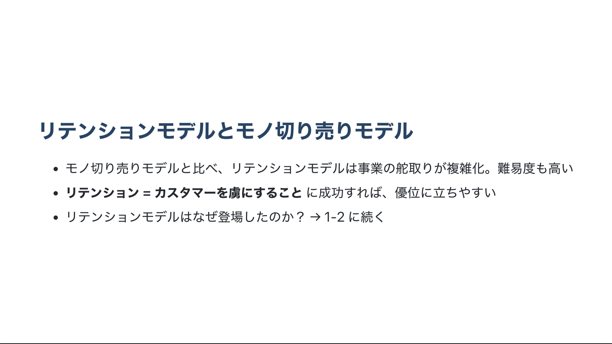
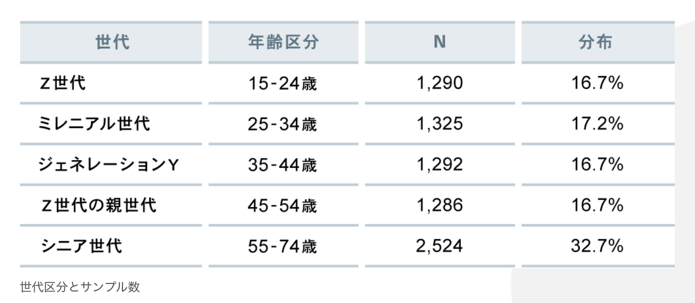

# カスタマーサクセスとは何か

## ~ 1-2. リテンションモデルへのシフトが不可避な理由 ~

2022/02/01

---

## 本日のまとめ

- ４つのトレンドのさらに背景に、デジタル技術革新を引き金とする押し返せない大波のようなトレンドのループが存在している
  1. 世の中の値付け標準が成果ベースへシフト
  2. 経済取引の選択権が利用者へシフト
  3. 競合プロダクトの価値が「中毒になるレベル」へシフト
  4. 競合のゴールがカスタマーのライフタイムバリュー最大化へシフト
  - → リテンションモデルへのシフトが必然として起きる
- **これらひとつひとつを正しく理解することはデジタル時代に生き残るために必須である**

---

## 前回のおさらい - 1

---

## 前回のおさらい - 2

---

## 前回のおさらい - 3

---

## リテンションモデル登場の裏にある大波の全容

- 音楽の世界でおきた大変換は「パブリッククラウドの登場がきっかけだ」
  - AWS の公開は 2006/07
- 供給側の変化
  - ハードとしての「モノづくり」が不要になった
  - ソフトとしての「モノづくり」コストが劇的に安くなった
    - 「How（モノをどうつくり・どう供給するか）」を考え実行するための多額の予算や専門スキルをもつ人材などのリソースがほぼ不要になった
    - 「What（どういう音楽サービスが）」や「Why（なぜ求められているのか）」の検討にたっぷり使うことができるようになった

---

- リテンションモデルが登場したのはクラウドの登場が理由か？
  - 否。クラウドの登場だけが理由ではない
  - デジタル技術革新が引き金となり、数多くの要因が絡み合う押し返せない大波のようなトレンドが存在する

---

### リテンションモデルの背景にあるトレンド

1. 世の中の値付け標準が成果ベースへシフト
   1. 利用者が、日常的・継続的にそのプロダクトを利用し、モノの所有に対してではなく成果に対して対価を払う
2. 経済取引の選択権が利用者へシフト
   1. 利用者が、いつでも利用を止める選択権を持ち、かつ初期費用が非常に少なくて済む
3. 競合プロダクトの価値が「中毒になるレベル」へシフト
   1. 利用者が、それ無しでは生活や仕事ができない・使い続けたいと断言できるほど明らかにプロダクトが常に最新状態に更新・最適化され続ける
4. 競合のゴールがカスタマーのライフタイムバリュー最大化へシフト
   1. 利用者が、自分にとって嬉しい成果を得られるならば、自分の個人データをプロバイダーが取得することを許す

この４つのトレンドのさらに背景に、デジタル技術革新を引き金とする押し返せない大波のようなトレンドのループが存在している

---

---

- 番号 ① ～ ⑬ が付いたトレンドは、それ一つ一つが単独で頻繁に議論されることの多い奥深いテーマである
- それら一つ一つは実はバラバラに存在しているのではなく、あるトレンドが他のトレンドへ影響し、それがさらに他のトレンドへ影響し……という相互の関係性が存在し、全体でループが回っている
- ループの中で各テーマが相互に作用しあう結果、一つ一つの足し算ではなく掛け算で加速的に拡大するインパクトが生まれる構図が存在する
- 堅固に結び付いたループが加速的に回る結果、その中の一つ一つのトレンドに個別に対処しても焼け石に水に等しい、あらがうことのできない大波が生まれている

---

### 1. 世の中の値付け標準が成果ベースへシフト

---

---

- ①「限界費用ゼロ社会へのシフト」
  - ほぼ無料の財・サービスが広く普及する協業型コモンズが台頭
  - その結果、価値の拠り所は関係性や信頼・善意へシフトし、私利金銭的利益よりも恊働共有利益が追求されるようになる

---

- ①「限界費用ゼロ社会へのシフト」
  - ②「所有 < 利用、成果重視の価値観」 を後押しする
  - ③「シェアリング経済、コミュニティ価値」 の登場を促す
    - 共有しあう関係性やコミュニケーションそのものに課金する価値の形態

---

- 事例）note
  - 見知らぬ人と人がつながってコミュニティが生まれ何かを共有する、その共有される体験そのものに価値がある
  - 「僕らは、コミュニケーションやリレーションに課金している。それらはコピーできないから、中国でも展開できるのだ」 by 加藤貞顕 CEO

---

---

- ③「シェアリング経済、コミュニティ価値」の拡大はそのまま ①「限界費用ゼロ社会へのシフト」 に直結
  - このように第１のループでは、デジタル技術革新が引き金となり、供給側のコスト構造などが変わるトレンドと、利用側の価値観が変わるトレンドが融合し、経済取引の価値の源泉がモノの所有から体験や成果ベースへシフトするトレンドが強化されていく

---

- ④「ミレニアル世代の影響力」
  - 1981~1995 年生まれ（2022 年現在、27~41 歳）
  - デジタルネイティブ。既成観念を壊す
  - 彼らが社会での影響力をさらに増すにつれ、第１のループ「世の中の価値付標準が成果ベースへシフト」は加速的に回転していく

---

（参考）[Z 世代を、ミレニアル世代、Y 世代と比較してみた～そのメディア意識とメンタリティ～ - 電通報](https://dentsu-ho.com/articles/8007)

---

---

### 2. 経済取引の選択権が利用者へシフト

---

---

- 第２のループは、スマートフォンが浸透することで個人の情報武装が飛躍的に進む結果の ⑤「カスタマーのスマート化」という利用トレンド側から始まる
  - 2014 年頃にはアメリカのスマホ保有率が 100%を超えた

---

- 利用側のトレンド ⑤「カスタマーのスマート化」
  - 供給者側のトレンド ⑥「ソフトウェア武装した反乱者のバリューチェーン破壊」 の引き金をひく
    - D2C (Direct-to-Consumer) で「利用者へ直接情報を届ける」

---

- 事例）ダラー・シェイズ・クラブ：新品 1 ＄ カミソリのサブスク。サービスの革新性で話題に。
  - 従来よりもはるかに低予算・高効果なマーケティング手法で市場に切り込んだ
  - [動画](https://youtu.be/ZUG9qYTJMsI)・[解説記事](https://ec-force.com/blog/d2c_no76)

---

- ダラー・シェイズ・クラブはコトや成果を重視して毎日の生活に新しいカミソリの習慣を取り入れた経験を周囲の人と共有するコトにも価値を見出した
  - ⑤「カスタマーのスマート化」 が ⑥「ソフトウェア武装した反乱者のバリューチェーン破壊」 を可能にし、新しい ③「シェアリング経済、コミュニティ価値」を増やしていく
  - 供給者側が従来握っていた経済取引の既得権が利用者へシフトする
    - 「カスタマー・イス・キング」の時代へ

---

---

### 3. 競合プロダクトの価値が「中毒になるレベル」へシフト

---

---

- 第三のループは、業界がソフトウェアで一新される ⑦「ソフトウェアのあらゆる産業侵略」トレンドからはじまる
  - マーク・アンドリーセンのコラム「[Why software is eating the world](https://www.wsj.com/articles/SB10001424053111903480904576512250915629460)」
    - 大学在籍中に Netscape Navigator を開発
    - 現在はベンチャーキャピタルの共同創業者兼ジェネラル・パートナー
  - リアルな世界にしか存在し得ないと思われた既存バリューチェーンの多くがソフトウェアに置き換わっている

---

- ⑦「ソフトウェアのあらゆる産業侵略」
  - ⑧「データ入手・継続的働きかけの日常化」トレンドを加熱させる
    - 以前は入手不能だった「プロダクトの買われ方・使われ方」に関する情報を客観詳細データとして入手できるようになった
    - カスタマーから日常的に直接データを取得し、分析に基づき個別化した働きかけを継続的にすることで絆を強める

---

- 事例）ウォルグリーンのポイント制度「バランス・リワード・プログラム」
  - 意志が開発した理論に基づく行動変容トレーニング手法に基づき、運動や禁煙行動に対してポイントを付与する「ヘルシーチョイス」が追加された
  - 店舗外の日常的な行動データに基づき、来店を促す個別化された働きかけがされる
  - ユーザーにとっては運動を継続する動機づけになるし、ウォルグリーンを使い続ける動機づけにもなる

---

- ⑧「データ入手・継続的働きかけの日常化」
  - ⑨「利用ギャップの増幅（手間の必須化）」トレンドを加速
    - デジタル技術の進化により、プロダクトでできることが加速的に増大・複雑化
    - 一方でカスタマーの利用能力には限界がある
      - **プロダクトでできること ← 利用ギャップ → カスタマーの利用能力**
    - カスタマーが利用できる・利用し続けたいと思うための工夫・手間が重要
      - 例）
        - 不要な機能を徹底的に削ぎ落とす
        - 初期費用や心理的な負担を極力減らす
        - 使いこなせるまで丁寧に指導する
        - etc...

---

- ⑧「データ入手・継続的働きかけの日常化」
  - ⑩「勝者オンリーワン化の爆速化」トレンドを加速
    - 例）本や日用雑貨などの規格品を買うときは迷わず Amazon へ

---

- このように第３のループでは、
  - ⑦「ソフトウェアのあらゆる産業侵略」が現実化するにつれて、取得できるデータの種類・量が桁違いに増える。
  - 少しでも絆を強めたい供給側で、⑧「データ入手／継続的働きかけの日常化」によるデータ争奪戦が加熱する。
  - ⑨「利用ギャップの増幅（手間の必須化）」はその加熱を後押しする。
  - 口コミが写真や動画で即座に伝播する現代は、⑩「勝者オンリーワン化の爆速化」でデータ争奪戦の勝負はあっという間に決まる。
  - 勝者となった ⑥「ソフトウェア武装した反乱者のバリューチェーン破壊」は威力が増し、破壊されたバリューチェーンはソフトウェアに置き換わって一新されていく。
- こうしたループが回る中で、**競合のプロダクト価値は中毒になるレベルへシフト** する。
  - 勝者オンリーワンの席とり合戦に勝ちたければ、まずデータ争奪戦で優位にたち、カスタマーを知り尽くすことで、常に最新・最適化されたプロダクトを提供しなければならない

---

---

### 4. 競合のゴールがカスタマーのライフタイムバリュー最大化へシフト

---

---

- 第４のループは、第３のループから派生
- ⑩「勝者オンリーワン化の爆速化」で勝ち残った企業が筆頭となり、取得データを更に拡充するため「ソフトウェア事業」から「ソフトウェア＋ハードウェア事業」へと守備範囲を拡大し始める
  - ⑪「ソフトウェア → ソフトウェア＋ハードウェア（取得データ拡充）」トレンド
    - 今（2018 年）現在のデータ争奪戦の勝者は GAFA (Google, Amazon, Facebook, Apple)

---

---

- 供給者が取得データを拡充するほど ⑫「時価エコノミー（ワクワク感の重視）」トレンドに拍車がかかる
  - 「実際に生み出した価値の大きさ」ではなく、「将来に生み出しそうな価値への期待感の大きさ」が重視される
    - 「未来を変えてくれる期待感」の大きいところへマーケットの資金が集中していく
    - 高い期待を寄せられた会社は、「未来の価値」（先端技術、優秀人材）を手に入れてさらに期待値を上げていく

---

---

- ⑬「モノ言う株主の影響力」トレンド
  - このトレンドを加速させる
  - 「新型アクティビスト」の台頭
    - リーマンショックや世界的な金融緩和で資金が集中

---

- このように第４のループでは、
  - ⑩「勝者オンリーワン化の爆速化」で急成長した勝者が、新天地でのデータ取得合戦も制覇するべく ⑪「ソフトウェア → ソフトウェア＋ハードウェア（取得データ拡充）」へと事業領域を広げる
  - すでに圧倒的なデータをもつ勝者の画期的なデータ戦略は ⑫「時価エコノミー（ワクワク感の重視）」を刺激し、「未来を変えてくれる期待感」がより高い企業により多くの資金と優秀な人材が集まる。
  - 結果、期待される企業ほど大胆な選択肢が実行可能になり、⑩「勝者オンリーワン化の爆速化」へ還流していく。
  - リーマンショック以降に存在感を示し始めた新たな ⑬「モノ言う株主の影響力」は、将来への期待感を重視するトレンドに拍車をかける。

---

---

- こうしたループが回る中で、競合のゴールがカスタマーのライフタイムバリュー（LTV）最大化へシフトする
  - 利用者
    - より優れたプロダクトが登場して自分の生活や仕事環境が改善することへの期待感
    - → 自分の詳細データ（取引履歴・行動履歴など）を供給者が持つことを許す
  - 供給者
    - 詳細データを貰い続けるためには、常に将来を期待される存在で有り続けなければならない

---

- 各ループの中で影響しあう１３項目のトレンドはひとつひとつが重要
- これらひとつひとつを正しく理解することはデジタル時代に生き残るために必須である
- ひとつひとつが影響し合うことで、押し返せない大波のようなトレンドのループが複数生まれ加速する
  - → リテンションモデルへのシフトが必然として起きる

---

---

## 本日のまとめ

- ４つのトレンドのさらに背景に、デジタル技術革新を引き金とする押し返せない大波のようなトレンドのループが存在している
  1. 世の中の値付け標準が成果ベースへシフト
  2. 経済取引の選択権が利用者へシフト
  3. 競合プロダクトの価値が「中毒になるレベル」へシフト
  4. 競合のゴールがカスタマーのライフタイムバリュー最大化へシフト
  - → リテンションモデルへのシフトが必然として起きる
- **これらひとつひとつを正しく理解することはデジタル時代に生き残るために必須である**

---
